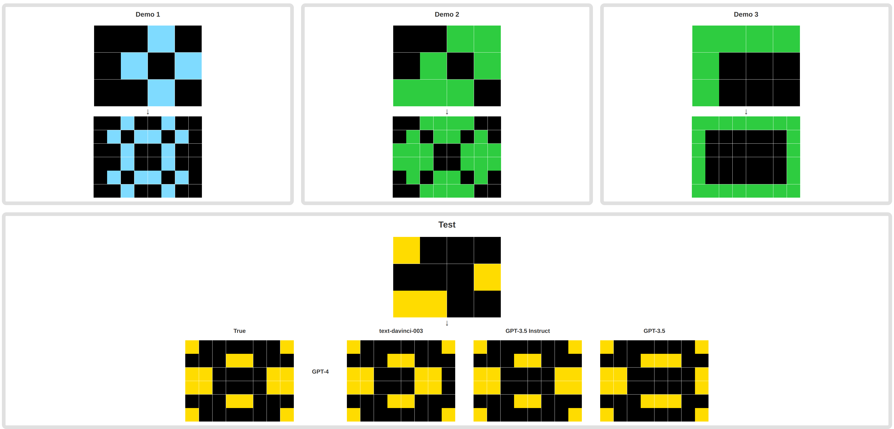

# ARC_LLMs : Keeping track of LLM progress on ARC
 
 *Head over to [alxndrtl.github.io/ARC](https://alxndrtl.github.io/ARC/) if you want to visualize the ARC tasks solved (or not) by LLMs !*
 


 
 This repo contains the code and results for the evaluation of some famous LLMs on the [Abstraction and Reasoning Corpus](https://github.com/fchollet/ARC).
 
 In the `responses` folder, there is one folder per model, with the completions of all the tasks it was evaluated on (as long as it answered with a valid response - ie one that can be made into a numpy array). The file `results.txt` shows on which specific tasks the different models succeeded. The code used to get the results is also available.
 
 The present document shows the results, then elaborates on why it matters and why this is interesting for present and future research, and finally, touch the point that while the ARC tasks were seen during training, there is little evidence, following multiple experiment, that the model just learned the tasks.
 
 ## Results
 
 The direct evaluation of ARC tasks on LLMs yields the following results :
 
<div align="center">
 
 | model                  | result |
|------------------------|--------|
| gpt-4                  | 21%    |
| gpt-4-turbo            | 18%    |
| text-davinci-003       | 14%    |
| gpt-3.5-turbo-instruct | 10.5%  |
| gpt-3.5-turbo (4k)         | 11%  |
| text-davinci-002       | 10.5%  |
| llama2-70b             | 4%     |
| llama2-70b-chat        | 0%     |

</div>

Note : these are pass@1 results. The ARC paper suggests to leave 3 tries to the human/model. This is not done here, only one try. 

All the models were evaluated on the same subset composed of 100 tasks choosen randomly (from the 400 training tasks), except for :
- text-davinci-002, evaluated on 200 of these 400 training tasks (choosen randomly).
- text-davinci-003 and gpt-3.5-turbo-instruct, evaluated on the whole 400 training tasks.
Default temperature was used (=1), except for gpt-3.5-turbo-instruct, gpt-3.5-turbo and gpt-4-turbo, where a temperature of 0 was used.

Note : some tasks were too long to fit in the context of some models (namely : text-davinci-003/2, and the llamas), but the percentage shown here doesn't take it into account (basically, a task is considered failed if its too big to fit in the context). It doesn't really matter, as most task that are long are failed by these models (more about it below).

<div align="center">

 | model                  | mean lenght of succeeded tasks | context lenght |
|------------------------|--------|--- |
| gpt-4                  | 1066    | 8k |
| gpt-3.5-turbo-instruct | 600  | 4k |
| gpt-3.5-turbo (4k)         | 553  | 4k|

</div>

The mean length of the tasks which the models were evaluated on is <b>2242</b>. So we see that the LLMs mostly succeed on short tasks. Is it because these tasks are easier ? or is it because their context-learning ability is limited to short contexts ? A little bit of both I would say. The gap between the 3.5 and 4 family is impressive.


## Why it matters ?

The most impressive fact about these results is, I think, the following : none of these models were trained to complete such tasks, they are just language models. Yet, they all developed the ability is solve a good part of these tasks. As if, learning to modeling language makes you inevitably, good at the ARC tasks.
And I think that this how the ARC tasks should be used : to purely evaluate a particular model, to "measure it". But a model shouldn't be trained on it.


Of course, the results we see here are made possible by the famous in-context learning ability of LLMs. But here, we see clearly that this ability is general.
Given 

```
mouse -> souris
dog -> chien
cat ->
```

predicting `chat` is an example of context-learning, but one can assume that tasks similar to these were often seen during training. On the contrary, tasks like ARC are relatively rare on the Internet, so it seems so that the results obtained here really show an ability learnt by the LLM. I don't know if this is clear enough.

In the end, this evaluation is a very good and precise way to measure the in-context learning ability of a particular LLM. Decorralted with any prior knowledge, and with no suspicion that a similar task was seen during training.

During the whole evaluation process, I was very attentive to the possible gap between RLHF'ed models and the others. The famous alignement tax, which makes aligned models weaker at ICL.
We clearly show it here, in particular between text-davinci-003 and gpt-3.5-turbo. This jump is confirmed with the llamas models.  If gpt-4, being RLHF'ed, obtains 21% of success rate, we could easily imagine that the base model reaches 25% or more success rate. Or maybe OpenAI found a way to get rid of this alignment tax ?
what is surprising is that gpt-3.5-turbo and gpt-3.5-turbo-instruct have the same performance...

Of course, 21% (for gpt-4) isn't 100%. But seeing the fast pace at which things go by these days, and seeing the jump from the 3.5 models to the 4 model, the future looks promising. François Chollet talked about ARC 2.0 coming in the near future, that will also be interesting!

One final note : I think that this benchmark is very interesting for the fine-tuning of LLMs. We see that turning an LLM into a chatbot with RLHF makes the success rate goes down by a few points. Inversly, can't we fine-tune an LLM in an other way, and have it perform better on ARC ? Of course, the final goal isn't to have a model good at ARC. As I said, training on the ARC tasks is I believe irrelevant. But a chatbot is just one possiblity among many other when one chooses what to do with a base LLM. See [Grounding Large Language Models in Interactive Environments with Online Reinforcement Learning](https://arxiv.org/abs/2302.02662), made by fellows I met in the Flowers team at Inria Bordeaux.

## "But it just learned the tasks during training" 

Of course, it has the seen, at least once, the tasks and their completion during its training. So all the results must be thrown away ?
I really don't think so.

As pointed out in the [Large Language Models as General Pattern Machines](https://arxiv.org/abs/2307.04721) paper, replacing the numbers with random tokens doesn't make the performance go to 0, at all.
In their paper, they reported that using a random "alphabet" makes the success rate from 85/800 to 44/800, with text-davinci-003.
With gpt-4, I only saw performance go from 21% to 17%, with the following alphabet : ['al', 'hello', 'rl', 'rf', 'was', 'once', 'hi', 'word', 'ape', 'ml'].

With gpt-3.5-turbo-instruct, I used different tokens and transposed all the tasks, and the success rate decreased of 1% only (for the 3 cases : transpose, modified alphabet, transpose and modified alphabet). Tokens were : ['G', 'D', 'E', 'B', 'A', 'C', 'F', 'H', 'I', 'J']

"But it has learned the mappings between the tokens". Interestingly, the tasks on which it succeeced in the normal and transposed case aren't the same. They are similar, as they are composed of the most easy tasks from the subset of tasks the models were evaluated from, but with a some notable differences. (tasks no. succeded in the normal case : 6, 19, 33, 34, 41, 54, 59, 72, 79, 85, and in the transpose case : 6, 14, 19, 31, 41, 58, 59, 72, 85).
There are tasks that the model can't solve in the normal case (seen during training) but can solve in the transposed case ! I think that this really makes the hypothesis "it has learned the tasks" not probable.

## To-Do
Focus the test on smaller models and see the impact of different training/fine-tuning choices.
For example, compare llama-7b with its code variants. Try phi-1.5 (first results aren't good, about 1%).
